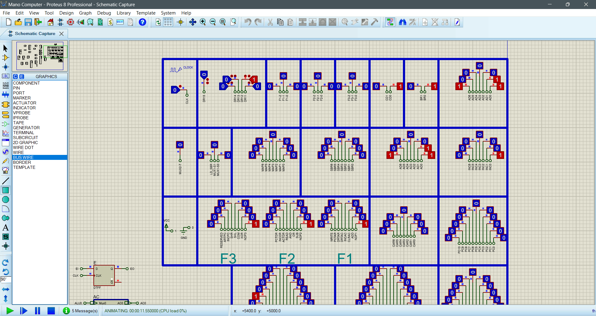
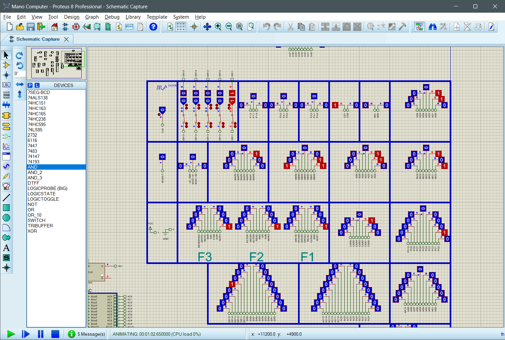
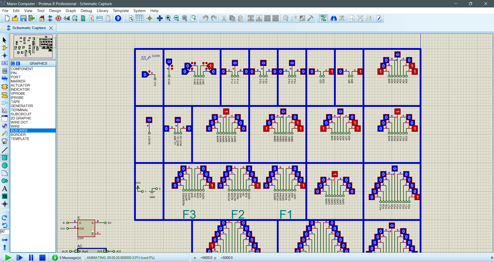
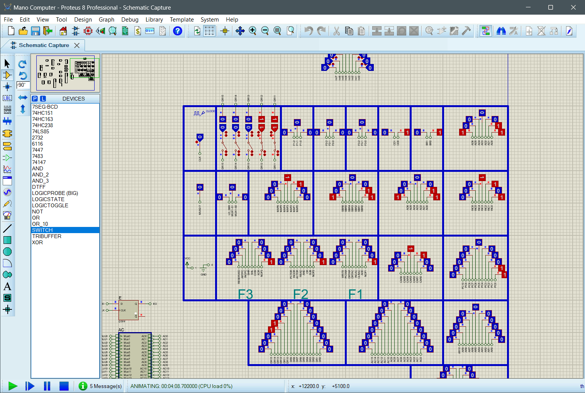

# Microprogrammed Mano Computer

This document provides an overview of the Microprogrammed Mano Computer, an implementation of the Mano Computer architecture that utilizes microprogramming for its control unit. The Mano Computer, designed by Charles R. Mano, is a simple yet powerful educational tool for understanding the basics of computer architecture.

## Table of Contents

- [Introduction](#introduction)
- [Microprogramming](#microprogramming)
- [Architecture](#architecture)
- [Microprogram for Control Memory](#microprogram-for-control-memory)
- [Usage](#usage)
- [Contributing](#contributing)

## Introduction

The Mano Computer is a conceptual model for a computer that includes a central processing unit (CPU), memory, and input/output devices. It is designed to illustrate the fundamental operations of a computer at the hardware level. The microprogrammed version of the Mano Computer introduces a control unit that is driven by a microprogram stored in control memory, offering a detailed view into the micro-operations and control signals that drive the CPU.

## Microprogramming

Microprogramming is a technique for implementing the control logic of a computer's CPU. Instead of hardwiring the control unit, microprogramming uses a sequence of microinstructions stored in a special memory called control memory. Each microinstruction specifies the control signals for one or more micro-operations, allowing for complex instruction execution sequences.

## Architecture

The architecture of the Microprogrammed Mano Computer includes the following components:

- **Arithmetic Logic Unit (ALU):** Performs arithmetic and logical operations.
- **Control Unit:** Utilizes microprogramming to control the sequence of operations.
- **Memory Unit:** Stores data and instructions.
- **Input/Output (I/O) Unit:** Manages data exchange with external devices.

## Microprogram for Control Memory

The control memory stores the microprogram that dictates the operation of the Mano Computer. Each entry in the control memory corresponds to a microinstruction that controls various parts of the computer for a single clock cycle. The microprogram for the Mano Computer includes sequences for basic operations such as ADD, STORE, BRANCH, and more.

For a detailed look at the microprogram, refer to the [microprogram for control memory](src/microprogram%20for%20control%20memory.txt) file.

## Usage

To simulate the Microprogrammed Mano Computer, follow these steps:

1. Clone the repository containing the project files.
2. Open the project in Proteus or a similar simulation software.
3. Run the simulation to observe the execution of microprogrammed instructions.

## Contributing

Contributions to the development and improvement of the Microprogrammed Mano Computer are welcome. Please feel free to submit issues and pull requests with enhancements, bug fixes, or documentation improvements.

## Pictures

Here are some Gifs of the Microprogrammed Mano Computer Instructions:

### 1-AND



### 2-BRANCH



### 3-STORE



### 4-EXCHANGE



Feel free to explore the repository for more images and diagrams related to the Mano Computer.

### main.cpp

Here are some code from [main.cpp](src/main.cpp):

```c++
void write() {
    vector<string> data = {
        // ADD(0-3)
        "000 000 000 01 01 1000011",
        "000 100 000 00 00 0000010",
        "001 000 000 00 00 1000000",
        "000 000 000 10 00 0000110",
        // other instructions
};

    ofstream outFile1("output1.bin", ios::binary);
    ofstream outFile2("output2.bin", ios::binary);
    ofstream outFile3("output3.bin", ios::binary);
    if (!outFile1 || !outFile2 || !outFile3) {
        cerr << "Failed to open files for writing.\n";
        return;
    }
    outFile1.clear();
    outFile2.clear();
    outFile3.clear();

    for (int i = 0; i < 16; i++) {
        // Remove spaces from the string
        string binaryString;
        for (char c : data[i]) {
            if (c != ' ')
                binaryString += c;
        }

        while (binaryString.length() < 24) {
            binaryString += "0"; // Pad with zeros
        }

        // Convert to binary and write to file
        bitset<24> bits(binaryString);
        unsigned long n = bits.to_ulong();

        // Write 3 bytes (24 bits) to the file
        outFile1.put(static_cast<char>((n >> 16) & 0xFF));
```
